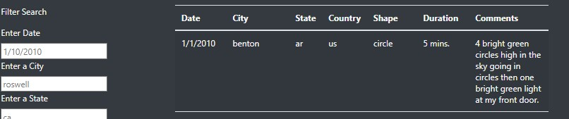
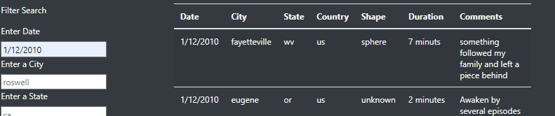

# Module 12 Challenge

## Overview of the Project
Build a webpage and dynamic table that provides a more in-depth analysis of UFO sightings by allowing users to filter for multiple criteria at the same time.

## Results
The results should be displayed immediately after inputting data in any of the text boxes. For example:

And immediately after you input data:

## Summary
Adding a button to the search bar to input the filters would help users interact with the webpage. Another issue that I have faced is that when I applied changes to the city textbox, it does not filter properly. I don't know why. 

Another change I could recommend would be a dropdown menu for some of the filtered data. This provides a concise user selection rather than guessing what data we have. This would also solve the filtering issues.
